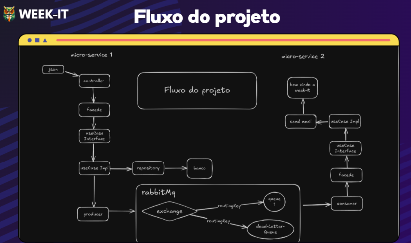

# 📧 RabbitMQ Email Producer Microservice

> Projeto desenvolvido para o minicurso **WeekIT** ministrado no **IFBA** (Instituto Federal da Bahia)

## 📋 Sobre o Projeto

Este projeto é um **microsserviço produtor de mensagens** que faz parte de uma arquitetura de microsserviços orientada a eventos. Ele é responsável por:

- 👤 Gerenciar o **cadastro de usuários** (CRUD)
- 🐰 Publicar eventos no **RabbitMQ** quando um usuário é criado
- 🔄 Demonstrar comunicação assíncrona entre microsserviços
- 📨 Disparar o fluxo de envio de e-mail de boas-vindas

### Arquitetura

O microsserviço recebe requisições REST para criação de usuários e, após persistir no banco de dados, publica um evento na exchange `user.events` do RabbitMQ para que outros serviços (como o Consumer Email MS) possam reagir.

```
[Cliente] ---> [Producer MS] ---> [RabbitMQ] ---> [Consumer Email MS] ---> [SMTP/Gmail]
                    |                 |
                    v           Exchange: user.events
                 [H2 DB]        Routing Key: user.created
```

## 📁 Estrutura do Projeto

```
src/main/java/com/estudo/senderemail/
├── SenderemailApplication.java   # Classe principal
├── application/                  # Camada de Aplicação
│   ├── dto/                      # Data Transfer Objects
│   │   ├── Request/              # DTOs de entrada
│   │   └── Response/             # DTOs de saída
│   ├── facade/                   # Facades para orquestração
│   ├── mapper/                   # Mapeadores (MapStruct)
│   └── usecase/                  # Casos de uso
│       └── user/
│           ├── CreateUserUseCase.java
│           ├── GetUsersUseCase.java
│           └── impl/             # Implementações
├── config/                       # Configurações (RabbitMQ, etc.)
│   └── RabbitMqConfig.java
├── domain/                       # Camada de Domínio
│   ├── entity/
│   │   └── User.java             # Entidade JPA
│   └── repository/
│       └── UserRepository.java   # Interface de repositório
├── infrastructure/               # Camada de Infraestrutura
│   └── messaging/
│       └── UserCreatedEventPublisher.java  # Publisher RabbitMQ
└── web/                          # Camada Web
    └── api/
        ├── UserApi.java          # Interface do Controller
        └── impl/
            └── UserApiImpl.java  # Implementação REST
```

## 🛠️ Tecnologias Utilizadas

| Tecnologia | Versão | Descrição |
|------------|--------|-----------|
| Java | 17 | Linguagem de programação |
| Spring Boot | 3.4.5 | Framework principal |
| Spring AMQP | - | Integração com RabbitMQ |
| Spring Data JPA | - | Persistência de dados |
| Spring Validation | - | Validação de dados |
| RabbitMQ | - | Message Broker |
| H2 Database | - | Banco de dados em memória |
| Lombok | - | Redução de boilerplate |
| MapStruct | 1.5.5 | Mapeamento de objetos |
| Maven | - | Gerenciador de dependências |

## ⚙️ Configuração

### Pré-requisitos

- Java 17+
- Maven 3.6+
- RabbitMQ rodando localmente (porta 5672)
- Docker e Docker Compose (opcional)

### Variáveis de Ambiente

Configure o arquivo `application.properties`:

```properties
# Servidor
server.port=8080

# Banco de Dados H2
spring.datasource.url=jdbc:h2:mem:testdb
spring.datasource.driverClassName=org.h2.Driver
spring.datasource.username=sa
spring.datasource.password=

# RabbitMQ
spring.rabbitmq.host=localhost
spring.rabbitmq.port=5672
spring.rabbitmq.username=guest
spring.rabbitmq.password=guest

# JPA
spring.jpa.hibernate.ddl-auto=update
spring.jpa.show-sql=true
spring.h2.console.enabled=true
```

## 🚀 Como Executar

### 1. Clone o repositório
```bash
git clone <url-do-repositorio>
cd rabbitmq-email-producer-ms
```

### 2. Inicie o RabbitMQ
```bash
# Usando Docker Compose
docker-compose up -d

# Ou usando Docker diretamente
docker run -d --name rabbitmq -p 5672:5672 -p 15672:15672 rabbitmq:management
```

### 3. Execute o projeto
```bash
# Windows
.\mvnw.cmd spring-boot:run

# Linux/Mac
./mvnw spring-boot:run
```

O serviço estará disponível na porta **8080**.

### 4. Acesse os serviços

| Serviço | URL | Credenciais |
|---------|-----|-------------|
| API REST | http://localhost:8080 | - |
| Console H2 | http://localhost:8080/h2-console | user: `sa`, senha: (vazio) |
| RabbitMQ Management | http://localhost:15672 | user: `guest`, senha: `guest` |

## 🔄 Fluxo da Aplicação


```
┌─────────────┐       ┌─────────────┐       ┌─────────────┐
│   Cliente   │──────▶│  REST API   │──────▶│   UseCase   │
│   (POST)    │       │  /api/users │       │ CreateUser  │
└─────────────┘       └─────────────┘       └──────┬──────┘
                                                   │
                                    ┌──────────────┼──────────────┐
                                    ▼                             ▼
                             ┌─────────────┐              ┌─────────────┐
                             │  Database   │              │  RabbitMQ   │
                             │    (H2)     │              │  Publisher  │
                             └─────────────┘              └─────────────┘
```

## 📨 Formato da Mensagem Publicada

O microsserviço publica mensagens no seguinte formato JSON:

```json
{
    "id": "uuid-do-usuario",
    "name": "Nome do Usuário",
    "email": "usuario@email.com"
}
```

| Propriedade | Valor |
|-------------|-------|
| **Exchange** | `user.events` |
| **Routing Key** | `user.created` |

## 📦 Docker Compose

O projeto inclui um `docker-compose.yml` para subir o RabbitMQ facilmente:

```yaml
services:
  rabbitmq:
    image: rabbitmq:3-management
    container_name: rabbitmq
    ports:
      - "5672:5672"   # Porta AMQP (aplicações)
      - "15672:15672" # Porta do painel de administração
    environment:
      RABBITMQ_DEFAULT_USER: guest
      RABBITMQ_DEFAULT_PASS: guest
```

## 📚 Conceitos Abordados no Minicurso

1. **Arquitetura de Microsserviços**
2. **Comunicação Assíncrona** com RabbitMQ
3. **Padrão Event-Driven Architecture**
4. **Spring Boot e suas integrações**
5. **Clean Architecture** (Use Cases, Facades)
6. **API REST** com Spring Web

## 🔗 Links Úteis

- 🎨 **Apresentação do Minicurso**: [Canva](https://www.canva.com/design/DAGnnRLhjzg/zO_EfSF6dlWwtGzG-ovEGw/view?utm_content=DAGnnRLhjzg&utm_campaign=designshare&utm_medium=link2&utm_source=uniquelinks&utlId=hd86155bba0)
- 📄 **Material do Minicurso**: [Google Docs](https://docs.google.com/document/d/1500lv3RDNYCX9M2GHXk87ktvktMas2kFLKmAnT4GOzg/edit?usp=sharing)
- 🐰 **RabbitMQ Management**: http://localhost:15672 (guest/guest)
- 🗄️ **H2 Console**: http://localhost:8080/h2-console

## 👨‍🏫 Sobre o Minicurso

Este projeto foi desenvolvido como material didático para o minicurso **WeekIT** ministrado no **Instituto Federal da Bahia (IFBA)**, com o objetivo de ensinar conceitos práticos de desenvolvimento de microsserviços utilizando Spring Boot e mensageria com RabbitMQ.

